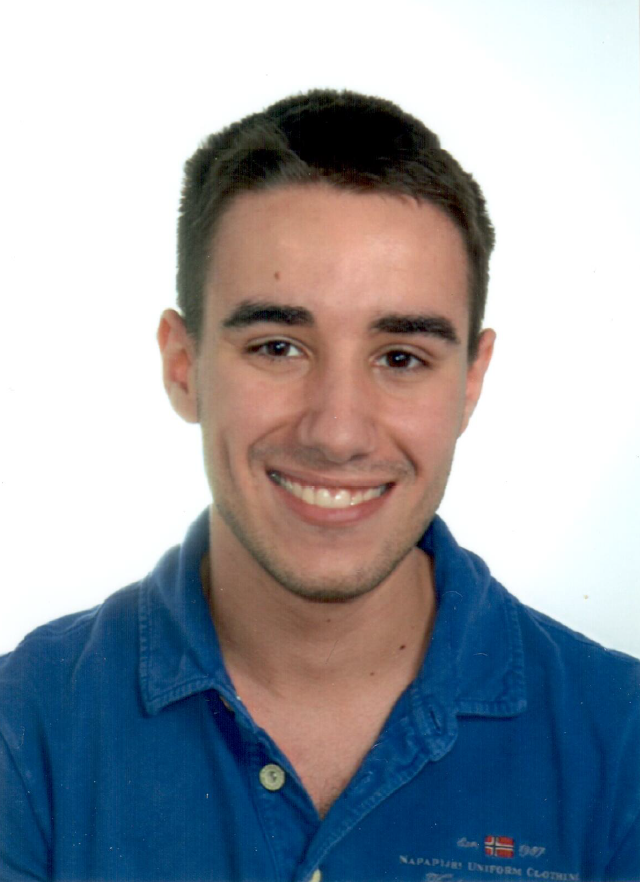

# Álvaro R. Puente-Uriona

**PhD Student in Solid State Physics**, *UPV/EHU*,

Algorta, Basque Country, Spain

[Email](mailto:alvaro.ruiz@ehu.eus) / [LinkedIn](https://www.linkedin.com/in/%C3%A1lvaro-r-puente-uriona-463049268/) / [ORCID](https://orcid.org/0000-0003-1915-8804) / [Google Scholar](https://scholar.google.com/citations?user=J2orspIAAAAJ) / [ResearchGate](https://www.researchgate.net/profile/Alvaro-R-Puente-Uriona)

## About Myself

I am a PhD student researching quantum optics. I currently work for the group of **Theory of Electronic and Optical Excitations in Solids**, on the **Materials Physics Center** at San Sebastián (Spain). My previous education has been centered on theoretical physics.

### My Skills

1. Theoretical Physics
   - Solid State Physics
   - Quantum Mechanics
   - Quantum Optics
   - *Ab initio* Methods
   - Wannier Functions
   - Group Theory
   - Differential Geometry
   - Fibre Bundles

2. Programming
   - Fortran
   - Python
   - C
   - C++

3. Git/GitHub

4. TeX/LaTeX

5. Synthesis and analysis of large quantities of data

## 📖 Education

1. **Bachelor's Degree in Physics**, University of the Basque Country (UPV/EHU), _(Sep. 2016 - May 2020)_

2. **Master's Degree in Quantum Science and Technology**, University of the Basque Country (UPV/EHU), _(Sep. 2020 - May 2021)_

## Job Experience

1. **PhD Student in Physics**, University of the Basque Country (UPV/EHU), _(Oct. 2021 - present)_

### 🏆 Accomplishments

-Distinction with honour in the subject "Computational Methods"

-"Editor's Suggestion" at the publication "*Ab initio* study of the nonlinear optical properties and dc photocurrent of the Weyl semimetal TaIrTe4"

## 💬 Languages

**Spanish** 🇪🇸: Native

**Basque**󠁳: Native

**English** 🇬🇧: C1

## 📜 Publications

1. "*Ab initio* study of the nonlinear optical properties and dc photocurrent of the Weyl semimetal TaIrTe4", [DOI](https://doi.org/10.1103/PhysRevB.107.205204), [arXiv](https://arxiv.org/abs/2302.03090)
2. "Topological phase diagram of optimally shaken honeycomb lattices: A dual perspective from stroboscopic and nonstroboscopic Floquet Hamiltonians", [DOI](https://doi.org/10.1103/PhysRevResearch.6.023244), [arXiv](https://arxiv.org/abs/2402.12113)
